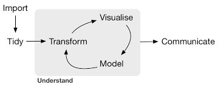
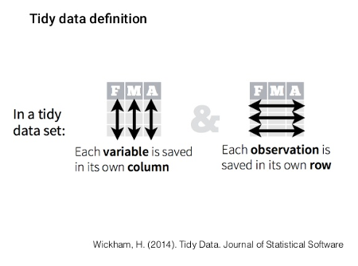
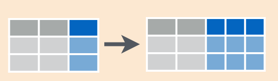
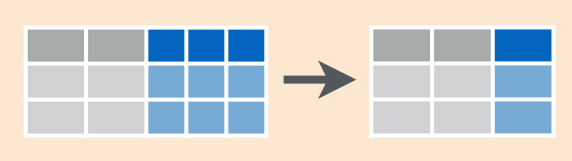

```{r setup, include=FALSE}
options(htmltools.dir.version = FALSE)
# options(crayon.enabled = TRUE)
load('data/data_workshop.Rdata')
```

class: title-slide

# An introduction to the tidyverse

## tidyr, dplyr and purrr

### Aitor Ameztegui .blue[@multivac42]  
.font70[University of Lleida]

### Víctor Granda .blue[@MalditoBarbudo]  
.font70[Joint Research Unit CTFC-CREAF]


#### **I SIBECOL meeting** (Barcelona, 4 de Febrero de 2019)


---
layout: true

<div class="tweaked-header" style="background-image: url(resources/images/tidyverse.png)"></div>

---

# tidyr, dplyr & purr: the tidyverse

--
background-image: url(resources/images/hadley.png)
background-position: right bottom

Created by Hadley Wickham, chief scientist of RStudio, and author of more than
30 R packages (`readr`, `ggplot2`, `plyr`, `devtools`, `roxygen2`, `rmarkdown`...)

--

The **tidyverse** is made up of those packages (and others), as a suite designed
to ease the data analysis in all its steps.

--



---

background-image: url(resources/images/hadley.png)
background-position: right bottom

# tidyr, dplyr & purr: the tidyverse

Created by Hadley Wickham, chief scientist of RStudio, and author of more than
30 R packages (`readr`, `ggplot2`, `plyr`, `devtools`, `roxygen2`, `rmarkdown`...)

The **tidyverse** is made up of those packages (and others), as a suite designed
to ease the data analysis in all its steps.


---

# Before we start...

- Neither `tidyr`, nor `dplyr` or `purrr` do anything that can't be done with
  base R code, apply family functions, for-loops or other packages.  

- Designed to be more efficient (in time), easier to read and easier to use. More intuitive to use, specially for beginners (it may requires some adaptation if used to base R code).

- Valid mostly for data.frames. For other formats (matrices, arrays) `plyr` can
  be used.

---

# *tidyverse*: tidy data



--

  - Data in **tidy** format eases the processing and analysis, particularly in
    vectorized lenguages as R.
    
---

# our data

  1. `plots [11858 x 15]`: all plots from the Third Spanish Forest Inventory (IFN3) in Catalonia  
  <br>
     
  2. `trees [111756 x 12]`: all trees with dbh > 7.5 cm measured in both
     IFN2 and IFN3  
  <br>
  
  3. `species [14778 x 15]`: number of trees per hectare in each plot, by
     species and size class  
  <br>
  
  4. `coordinates [11858 x 6]`: X and Y UTM coordinates of each plot.  
  <br>
  
  5. `leaf [10447 x 3]`: leaf biomass and carbon content for those IFN 3 plots where they
    where available  
  <br>

---

# let's have a look at the data

```{r, echo=FALSE, message=FALSE, warning=FALSE}
library(tidyverse)
load('data/data_workshop.Rdata')
options(width = 70)
```

```{r tibbles, }
trees
```

---

# let's have a look at the data

```{r tibbles_class, }
class(trees)
```

Tibbles, not usual data.frames:

  - class `tbl_df`
  
  - print only 10 rows by default
  
  - informs about variable types
  
  - Besides that, it is like a data.frame
  (it *is* a data.frame)

---
layout: false
class: inverse
background-image: url(resources/images/dplyr.png)

# dplyr

---
layout: true

<div class="tweaked-header" style="background-image: url(resources/images/dplyr.png)"></div>
---

# 5 main verbs of dplyr

  - `filter`: keep the rows that match a condition
  
  - `select`: keep columns by name
  
  - `arrange`: sort rows
  
  - `mutate`: transform existent variables or create new ones
  
  - `summarise`: do some summary statistics and reduce data

---

# common structure

## (for most of the tidyverse)

```r
verb(data, ...)
```

- first argument: data (as data.frame or tbl_df)
- the rest of arguments specify what to do with the data frame
- output is always another data frame (tbl_df or data.frame)
- unless we are assigning (`<-`), never modifies the original data frame

---

.middle[.center[.font200[
`filter`
]]]


.center[]


---

# Selecting rows (`filter`)

```{r, filter_ex}
filter(trees, Dist < 3)
```


---

# Selecting rows (`filter`)

```{r, filter_ex2}
filter(trees, Provincia == '25')
```

---

# Selecting rows (`filter`)

```{r, filter_ex3}
filter(trees, CD %in% c(45, 70))
```

---

# Selecting rows (`filter`)


---

# Selecting rows (`filter`)

## Exercise 1

Let's find those plots in IFN3n (`plots` data frame) that:

  1.1 Are located either in Barcelona (08) or Girona (17)
  
  1.2 Were measured **before** January 2001
  
  1.3 It took **more** than 2 hours to measure (7200s)

---

.middle[.center[.font200[
`select`
]]]
.center[]


---

# Selecting columns (`select`)

```{r select_data}
trees
```

---

# Selecting columns (`select`)

```{r select_ex}
select(trees, DiamIf3)
```

---

# Selecting columns (`select`)

```{r select_ex2}
select(trees, -Codi)
```

---

# Selecting columns (`select`)

```{r select_ex3}
select(trees, Codi:Dist)
```

---

# Selecting columns (`select`)

## Special functions:

- `starts_with`
- `ends_with`
- `contains`
- `match`
- `num_range`
- `one_of`
- `everything`

---

# Selecting columns (`select`)

```{r select_ex4}
select(trees, starts_with('Diam'))
```

---

# Selecting columns (`select`)

## Exercise 2

Think if three or four ways to select the variables that define the start and finish date
of plot measuring

---

.middle[.center[.font200[
`arrange`
]]]
.center[]

---

# Sorting rows (`arrange`)

```{r arrange_ex}
arrange(trees, Dist)
```


---

# Sorting rows (`arrange`)

```{r arrange_ex2}
arrange(trees, desc(Dist))
```

---

# Sorting rows (`arrange`)

## Exercise 3

  3.1 Sort plots by date and hour of measurement
  
  3.2 Which plots were started to be measured later in the day?
  
  3.3 Which plots took longer to be measured?

---

.middle[.center[.font200[
`mutate`
]]]
.center[]

---

# Transforming variables (`mutate`)

```{r mutate_ex}
mutate(
  trees,
  Dist = Dist * 100
)
```


---

# Transforming variables (`mutate`)

```{r mutate_ex2}
mutate(
  trees,
  Alometria = DiamIf3 / HeiIf3,
  Alometria2 = Alometria * DiamIf2
)
```

---

# Transforming variables (`mutate`)

## Special functions:

- `if_else`

```{r if_else}
mutate(
  trees,
  Especie = if_else(Especie == '021', 'Pinus sylvestris', 'Other')
)
```

---

# Transforming variables (`mutate`)

## Exercise 4

  4.1 Get growth (in cm) of each tree between IFN2 and IFN3

  4.2 Create two new variables with basal area per hectare of each tree, both for IFN2 and
      IfN3. Which is the species of the fastest-growing tree in basal area?

<br>

.center[Clue:]
$$
AB = \frac{\pi}{4} · Diam^{2} · N
$$

---

.middle[.center[.font200[
`summarise`
]]]
.center[]

---

# Reducing variables (`summarise`)

```{r summarise_ex}
summarise(trees, mean_if3 = mean(DiamIf3))
```

---

# Reducing variables (`summarise`)

## Summary functions

  - `min(x)`, `max(x)`, `quantile(x, p)`
  
  - `mean(x)`, `median(x)`, 
  
  - `sd(x)`, `var(x)`, `IQR(x)`
  
  - `n()`, `n_distinct(x)`
  
  - `sum(x > 10)`, `mean(x > 10)`
---

.middle[.center[.font200[
`grouped summarise`
]]]


.center[]

---

# Reducing variables (`summarise`)

## Grouped summarise

```{r grouped_summ_ex}
by_province <- group_by(trees, Provincia)
by_province
```

---


# Reducing variables (`summarise`)

## Grouped summarise

```{r grouped_summ_ex_2}
summarise(
  by_province,
  mean_height_ifn3 = mean(HeiIf3, na.rm = TRUE),
  max_height_ifn3 = max(HeiIf3, na.rm = TRUE),
  min_height_ifn3 = min(HeiIf3, na.rm = TRUE)
)
```

---

# Reducing variables (`summarise`)

## Exercise 5

Which statistics would you calculate to characterize diameter values in each plot?

---
class: code60

# Targeted transformations

## `summarise_if` and `summarise_at`

We can apply a summarising function to a group of variables...  

  - that share some commmon characteristic that can be tested (i.e. numeric variables)

```{r summarise_if}
summarise_if(trees, is.numeric, mean)
```

  - by name or using the select helpers (`starts_with`, `ends_with`, `one_of`)

```{r summarise_at}
summarise_at(trees, vars(starts_with('Diam')), mean)
```

---
class: code60

# Targeted transformations

## `mutate_if` and `mutate_at`

The same can be done with `mutate`:

.pull-left[
```{r mutate_if}
mutate_if(trees, is.numeric, log)
```
]

.pull-right[
```{r mutate_at}
mutate_at(
  trees, vars(one_of(c('Especie', 'Species'))),
  ~ paste0('sp_', .x)
)
```
]

---
layout: false
class: inverse
background-image: url(resources/images/pipe.png)

# pipes

---
layout: true

<div class="tweaked-header" style="background-image: url(resources/images/pipe.png)"></div>

---

class: code80

# Data pipelines (`%>%`)

  - Often, we want to use several verbs (filter, arrange, group_by, summarise...)

  - Multiple operations are difficult to read, or require to create multiple intermediate
    objects:

.pull-left[

```{r bad_left, eval = FALSE}
diam_especie <- filter(
  summarise(
    group_by(
      filter(
        trees, !is.na(DiamIf3)
      ),
      Codi, Especie
    ),
    diam = mean(DiamIf3),
    n = n()
  ),
  n > 5
)
```

]

.pull-right[

```{r bad_right, eval = FALSE}
no_na_trees <- filter(
  trees, !is.na(DiamIf3)
)
no_na_trees_grouped <- group_by(
  no_na_trees, Codi, Especie
)
summarised_no_na_trees <- summarise(
  no_na_trees_grouped,
  diam = mean(DiamIf3), n = n()
)
final_data <- filter(
  summarised_no_na_trees, n > 5
)
```

]

---

# Data pipelines (`%>%`)

  - Alternative (cleaner and easy to read): *pipe* operator (`%>%`) from `magrittr` package
  
  - The result of the left side is passed to the function in the right as first argument:
  
  `f(x, y)` is the same as `x %>% f(y)`  
  `f(x, y, z)` is the same as `x %>% f(y, z)`

  - In the tidyverse `%>%` makes each function to be applied to the data frame resulting
    from the previous step
  
  `filter(df, color == 'blue')` is the same as `df %>% filter(color == 'blue')`  
  `mutate(df, double = 2*value)` is the same as `df %>% mutate(double = 2*value)`

---
class: code80

# Data pipelines (`%>%`)

.pull-left[

Nested functions

```{r bad_left_2, eval = FALSE}
diam_especie <- filter(
  summarise(
    group_by(
      filter(
        trees, !is.na(DiamIf3)
      ),
      Codi, Especie
    ),
    diam = mean(DiamIf3),
    n = n()
  ),
  n > 5
)
```

]

--

.pull-right[

Functions key

```{r ok_right, eval = FALSE}
diam_especie <- trees %>%
  filter(!is.na(DiamIf3)) %>%
  group_by(Codi, Especie) %>%
  summarise(
    diam = mean(DiamIf3),
    n = n()
  ) %>%
  filter(n > 5)
```

]

---

# Data pipelines (`%>%`)

## Exercise 6

Create pipelines to answer the following questions:

  6.1 Which plots have the fastest average growth rate?
  
  6.2 Which is the plot with the most species?
  
  6.3 Is there any relationship between both variables?

---
layout: true

<div class="tweaked-header" style="background-image: url(resources/images/dplyr.png)"></div>
---

.middle[.center[.font200[
`grouped mutate`
]]]


.center[]


---

class: code60

# Grouped `mutate`/`filter`

We will commonly use groups (`group_by`) when summarising variables (*n* inputs, one
output):

```r
group_by(Especie) %>% summarise(mean = mean(Diam))
```

---
class: code60

# Grouped `mutate`/`filter`

Sometimes, however, we may be interested in calculating new variables by group, but without
reducing the dimensions:

```{r}
trees %>%
  group_by(Especie) %>%
  mutate(
    std_diam = DiamIf3 - mean(DiamIf2)
  )
```


---

# Grouped `mutate`/`filter`

## Exercise 7

  7.1 Identify those trees that grow most as compared to the average in that plot
  
  7.2 Identify those plots where a species grows much more than the average for the species

Extra (in case you get bored):  

  7.3 Select IFN plots with pure *Pinus nigra* stands (Especie =
      025). Note: we consider a forest to be monospecific when > 80% in BA corresponds to
      a single species
      

---

# Joining data (`*_join`)

## Mutating joins

  - `left_join(x, y)`: Add observations in y that also appears in x. Original observations
    (x) are not lost
  
  - `right_join(x, y)`: Add observations in x that also appears in y. Original observations
    (y) are not lost
  
  - `full_join(x, y)`: All observations, x and y
  
  - `inner_join(x, y)`: Only observastions present in x and y

---

# Joining data (`*_join`)

## Filtering joins

  - `semi_join(x, y)`: Keep observations in x that are present in y
  
  - `anti_join(x, y)`: Remove observations in x present in y

---

# Joining data (`*_join`)

## Exercise 8

Add X and Y coordinates that are included in the `coordinates` data frame to each plot in
the `plots` data frame

---
layout: false
class: inverse
background-image: url(resources/images/tidyr.png)

# tidyr

---
layout: true

<div class="tweaked-header" style="background-image: url(resources/images/tidyr.png)"></div>

---

# tidy data

.center[

]

--

  - Data in **tidy** format eases the processing and analysis, particularly in
    vectorized lenguages as R can be.

---

# tidyr

Data is not always organized...

```{r tb, echo=FALSE}
tb <- as_tibble(read.csv("tb.csv", stringsAsFactors = FALSE)) %>%
  magrittr::set_names(
    ., stringr::str_remove(names(.), 'new_sp_')
  ) %>%
  select(-new_sp)
tb
```

---

# tidyr

.center[
```{r tb2, echo=FALSE}
tb %>%
  gather(demo, n, -iso2, -year, na.rm = TRUE) %>%
  separate(demo, c("sex", "age_group"), 1) %>%
  arrange(iso2, year, sex)
```
]

---

# tidyr

## The verbs of tidyr

  - `gather`: Convert data from *wide* to *long* format (columns to id-value pairs)
  - `spread`: Convert data from *long* to *wide* format (id-value pairs to columns)
  - `separate`: Convert one column in serveral
  - `unite`: Join several columns in one

---

# tidyr

## common structure (for most of the tidyverse)

```r
verb(data, ...)
```

- first argument: data (as data.frame or tbl_df)
- the rest of arguments specify what to do with the data frame
- output is always another data frame (tbl_df or data.frame)
- unless we are assigning (`<-`), never modifies the original data frame

---

.middle[.center[.font200[
`gather` & `separate`
]]]
.center[]
.center[]

---

# tidyr

## `gather`

```{r gather_ex}
n_parcelas <- tibble(
  Prov = c('Lleida', 'Girona', 'Barcelona', 'Tarragona'),
  IFN_2 = c(16, 78, 60, 34),
  IFN_3 = c(18, 79, 67, 36)
)

n_parcelas
```

---

# tidyr

## `gather`

```{r gather_ex2}
n_parcelas_tidy <- n_parcelas %>%
  gather(IFN, n, IFN_2, IFN_3)

n_parcelas_tidy
```

---

# tidyr

## `separate`

```{r gather_ex3}
n_parcelas_sep <- n_parcelas %>%
  gather(IFN, n, IFN_2, IFN_3) %>%
  separate(IFN, c('name', 'ifn_version'), sep = '_')

n_parcelas_sep
```

---

# `gather` and `separate`

## Exercise 9

Use `gather` and `separate` to transform the data frame species into a **tidy** format,
where each column is a variable and each row an observation

```{r gather_ex_4, echo=FALSE}
species
```

---

.middle[.center[.font200[
`spread` & `unite`
]]]
.center[]
.center[]

---

# tidyr

## `spread`

```{r spread_ex}
n_parcelas_tidy %>%
  spread(IFN, n)
```

---

# tidyr

## `unite`

```{r unite_ex}
n_parcelas_sep %>%
  unite(IFN, name, ifn_version, sep = '_')
```

---

# `spread` and `unite`

## Exercise 10

Use `unite` and `spread` to transform the data from exercise 9 into its original format

---
layout: false
class: inverse
background-image: url(resources/images/purrr.png)

# purrr

---
layout: true

<div class="tweaked-header" style="background-image: url(resources/images/purrr.png)"></div>

---

# purrr

Allows to do functional programming with R, making loops and repetitive tasks
pipe-friendly and easier to read.

```{r purrr_ex}
c(1, 2, 3) %>%
  map_dbl(~ .*2)

c('a', 'b', 'c') %>%
  map_chr(~ paste0('treatment_', .))
```

Can be used as alternatives to `apply` family functions (`lapply`, `vapply`...)

---

# purrr

## common structure

```r
verb(.x, .f, ...)
```

- first argument: vector or list (included data frames)
- second argument: function to apply to each element of .x
- output is always a vector or a list of the same length as .x

---

# purrr

## The verbs of purrr

  - `map`: Tranforms the input by applying a function to each element and returning a
    vector the same length as the input
    
  - `walk`: The same as `map`, but only for the side-effect, returning the original input
  
---

# map

## Flavours

  - `map`: Returns always a list
  - `map_chr`, `map_dbl`, `map_int`, `map_lgl`: Returns a vector of the corresponding type
  - `map_dfr`, `map_dfc`: Returns a data frame created by row- or column-binding

---

# map

## functions

Functions to apply to each element can be supplied in different forms:

  - lambda function: starting with `~` and with `.` as the element placeholder

```{r, eval=FALSE}
list.files('data', '.csv', full.names = TRUE) %>%
  map_dfr(~ read_csv(., col_types = 'ccccc???????'))
```

  - function name: if it needs extra arguments, can be supplied after the function name

```{r, eval=FALSE}
list.files('data', '.csv', full.names = TRUE) %>%
  map_dfr(read_csv, col_types = 'ccccc???????')
```

---

# map

## Models workflow become easier

```{r model_ex}
trees %>%
  split(.$Provincia) %>%
  map(~ lm(HeiIf3 ~ DiamIf3, data = .)) %>%
  map_dfr(~ broom::tidy(.))
```

---
class: code50

# walk

## Side-effects

Sometimes we want to perform a pipe step only for its side-effect (printing, plotting...)
but continue with the pipe afterwards. We could write an intermediate step or we can use
walk

```{r}
list.files('data', '.csv', full.names = TRUE) %>%
  walk(print) %>%
  map_dfr(read_csv, col_types = 'ccccc???????')
```

---

# purrr

## Exercise 11

In this exercise we will use some of the knowledge acquired in this workshop

  11.1 Lets see if there is a relationship between leaf biomass (in the `leaf` dataset)
    and tree height (in the `trees` dataset), for each province at the plot level. For that
    you will need to summarise tree values, join with the leaf data, split by provinces and
    perform the model for each province.

---
layout: false
class: thanks clear middle

.font160[Thank you!]

<br>

`r icon::fa("twitter")` @multivac42  
`r icon::fa("github")` https://github.com/ameztegui/  
`r icon::fa("envelope")` aitor.ameztegui@eagrof.udl.cat  

`r icon::fa("twitter")` @MalditoBarbudo  
`r icon::fa("github")` https://github.com/malditobarbudo/  
`r icon::fa("envelope")` v.granda@creaf.uab.cat  

<br>

Presentation repository:  
`r icon::fa("github")` https://github.com/ameztegui/tidyverse_workshop
